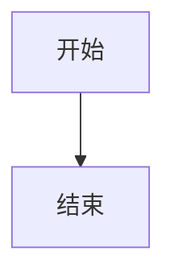

# md2word — Markdown to Word Tool

**项目路径:** `D:\git\lsqkk\md2word\` (已注册为系统命令 `md2word`)

---

## 安装

```bash
# 核心安装（必需）
pip install -e D:/git/lsqkk/md2word

# 全部可选依赖
pip install -e "D:/git/lsqkk/md2word[all]"

# 按需安装可选组件
pip install -e "D:/git/lsqkk/md2word[highlight]"   # 代码高亮 (pygments)
pip install -e "D:/git/lsqkk/md2word[math]"         # 公式渲染 (matplotlib, latex2mathml)
pip install -e "D:/git/lsqkk/md2word[svg]"          # SVG 嵌入 (resvg)
pip install -e "D:/git/lsqkk/md2word[watch]"        # 文件监听 (watchdog)
```

查看可选依赖状态：
```bash
md2word --check-deps
```

---

## 核心命令

### 基本转换

```bash
# 单文件 → docx（自动搜索内置主题模板）
md2word input.md -o output.docx

# 批量转换（每个 .md → 同名 .docx）
md2word file1.md file2.md file3.md

# 标准输入
cat doc.md | md2word -o output.docx
```

### 模板与主题

```bash
# 指定内置主题
md2word input.md --theme academic -o output.docx
md2word input.md --theme official -o output.docx
md2word input.md --theme redhead -o output.docx

# 使用自定义 .docx 模板
md2word input.md -t 我的模板.docx -o output.docx

# 生成主题模板（供自定义修改）
md2word --create-template 新模板.docx --theme academic

# 验证模板中必需的引导段落是否齐全
md2word --validate-template 模板.docx

# 列出模板中已识别的引导段落及其格式
md2word --list-styles -t 模板.docx

# 列出所有可用主题
md2word --list-themes
```

### 红头文件

```bash
# 一键生成红头文件（发文机关名 + "文件" + 红色分隔线 + 文号）
md2word 通知.md --redhead "XX市人民政府" --theme redhead

# 自动行为：TOC 默认关闭、正文首行缩进、标题方正小标宋 26pt
# 如需强制开启目录，追加 --toc
```

### 格式控制

```bash
md2word input.md --toc                       # 生成目录（红头文件默认无目录）
md2word input.md --no-toc                    # 显式禁用目录
md2word input.md --toc-depth 1-4             # 目录深度（默认 1-3）
md2word input.md --number-headings           # 标题自动编号（1, 1.1, 1.1.1）
md2word input.md --page-break                # H1 前分页
md2word input.md --three-line-table          # 三线表（顶线+表头下线+底线，无竖线）
md2word input.md --image-width 4.5           # 图片最大宽度（英寸，默认 5.5）
md2word input.md --page-number "-- %d --"    # 页码格式（%d 为页码占位符）
md2word input.md --no-footnotes              # 禁用脚注处理
md2word input.md --no-highlight              # 禁用代码高亮
md2word input.md --no-math                   # 禁用公式渲染
md2word input.md --no-mermaid                # 禁用 Mermaid 图表
```

### 配置文件

```bash
# 自动检测（按优先级）：
# .md2word/config.yaml > md2word.yaml > md2word.yml > md2word.json > pyproject.toml
md2word input.md

# 指定配置文件
md2word input.md --config 路径/config.yaml

# 项目级目录（自动加载 .md2word/config.yaml 和 .md2word/template.docx）
md2word input.md --project-dir /path/to/project

# 配置示例（md2word.yaml）：
#   theme: academic
#   toc: true
#   number-headings: true
#   three-line-table: true
#   page-break: true
#   image-width: 4.5
#   redhead: XX市人民政府
# 
# CLI 参数优先级 > 配置文件 > 默认值
```

### 高级功能

```bash
# GB 标准合规检查（检查页边距/字体是否符合 GB/T 9704-2012）
md2word input.md --theme official --gb-check

# 增量转换（MD5 缓存，仅处理内容变化的文件）
md2word file1.md file2.md --incremental

# Watch 模式（文件变化自动重新转换）
md2word input.md --watch

# 监听多个目录/文件
md2word dir/ file.md --watch
```

---

## 内置主题

| 参数 | 文件名 | 用途 | 字体 | 页边距 |
|------|--------|------|------|--------|
| `official` | 官方公文.docx | 政府公文 | 仿宋正文+黑体标题 | (3.7, 3.5, 2.8, 2.6)cm |
| `academic` | 学术论文.docx | 学位论文/期刊 | 宋体+黑体标题 | (2.54, 2.54, 3.17, 3.17)cm |
| `academic-plus` | 学术论文_增强版.docx | 含摘要/关键词/参考文献 | 宋体+黑体标题 | (2.54, 2.54, 3.17, 3.17)cm |
| `tech` | 技术文档.docx | API 文档/手册 | 微软雅黑+深蓝标题 | (2, 2, 2.5, 2.5)cm |
| `media` | 自媒体排版.docx | 公众号/社交传播 | 宋体+雅黑标题+橙 | (1.5, 1.5, 2, 2)cm |
| `redhead` | 红头文件.docx | **红头文件专用** | 方正小标宋标题+仿宋正文 | (3.7, 3.5, 2.8, 2.6)cm |

### redhead 主题专有行为

- 一级标题：方正小标宋简体 26pt（一号），居中
- 正文：仿宋 16pt（三号），首行缩进 0.85cm（2字符）
- 配合 `--redhead` 使用时自动关闭目录
- GB/T 9704-2012 标准页边距

---

## 引导段落模板系统

### 原理

模板 docx 中包含以特定关键词开头的"引导段落"。工具读取这些段落的格式（字体、字号、颜色、对齐、缩进、行距），应用到对应的 Markdown 元素上。**用户只需在 Word 中修改引导段落的格式，即可自定义输出样式。**

### 关键词列表

| 关键词（中/英文） | 样式槽位 | 对应元素 |
|-------------------|---------|----------|
| 一级标题 / heading 1 | `h1` | `# 标题` |
| 二级标题 / heading 2 | `h2` | `## 标题` |
| 三级标题 / heading 3 | `h3` | `### 标题` |
| 四级标题 / heading 4 | `h4` | `#### 标题` |
| 五级标题 / heading 5 | `h5` | `##### 标题` |
| 正文 | `body` | 普通段落 |
| 首行缩进 | `body_indent` | 首行缩进的正文* |
| 图片 | `image` | `` 容器 |
| 图注 | `figcaption` | 图片下方说明 |
| 引用 / quote | `quote` | `> 引用块` |
| 代码 / code block | `code` | 代码块 |
| 无序列表 / bullet list | `bullet_list` | `- 列表项` |
| 有序列表 / ordered list | `number_list` | `1. 列表项` |
| 目录标题 / table of contents | `toc_title` | 目录上方标题 |

*注：`body_indent` 目前作为"正文"的备用映射，实际正文段落使用 `body` 槽位样式。建议在正文样式中直接设置首行缩进。

### 检测规则

1. 按引导段落**在模板中的出现顺序**匹配
2. 先匹配到的优先（靠前的段落优先级高）
3. 匹配时去标点、去空格、忽略大小写
4. 一个槽位被匹配后，模板中后续的同关键词段落不再生效

### 模板验证

```bash
# 验证模板是否缺失必需段落
md2word --validate-template 模板.docx

# 必需的：一级标题、二级标题、三级标题、正文
# 推荐的：首行缩进、图片、图注、引用、代码、无序/有序列表、目录标题
```

---

## Markdown 支持语法

### 基础元素

```markdown
# 一级标题
## 二级标题
### 三级标题
#### 四级标题
##### 五级标题

普通正文段落。

> 引用块

- 无序列表项
- 另一项

1. 有序列表项
2. 另一项

`行内代码`
```

### 脚注

```markdown
这是带脚注的文字[^1]。

[^1]: 脚注内容，支持多行。
```

规则：
- `[^id]` 格式，id 为数字或字母
- 定义必须放在正文之后，用空行分隔
- 定义段落以 `[^id]: ` 起始
- 多行脚注：续行缩进 2 个空格
- 无对应定义的引用会在输出中保留原文

### 交叉引用

```markdown
参考[数据说明](#数据说明)。    → Word REF 域，引用标题"数据说明"
详细设置见[表1](#表1)。        → 引用表格
请参见[图1](#图1)。            → 引用图片
```

- 方括号内 `[文字](#锚点名)` 格式
- 锚点名为目标标题或编号
- 在 Word 中 Ctrl+A → F9 更新域后生效

### 数学公式

```markdown
内联公式：$E = mc^2$
块级公式：$$\sum_{i=1}^{n} i = \frac{n(n+1)}{2}$$
```

- 依赖：matplotlib + latex2mathml（`pip install -e ".[math]"`）
- 转换为目标：Word OMML（原生可编辑公式）
- 块级公式自动添加 SEQ 编号
- 如果 latex2mathml 无法解析：回退为 matplotlib 渲染的 SVG

### Mermaid 图表

````markdown

````

- 方案 1：通过 http://mermaid.ink/ API 渲染（默认，无需本地安装）
- 方案 2：使用本地 mermaid-cli（需安装 `mmdc`）
- 输出为 SVG 嵌入 docx

### 表格

```markdown
| 列1 | 列2 | 列3 |
|-----|-----|-----|
| A   | B   | C   |
```

- `--three-line-table`：仅保留顶线、表头下线、底线（三线表风格）
- 默认：使用 python-markdown 的标准表格样式

### 图片

```markdown

```

- 支持本地路径和 HTTP/HTTPS URL
- 自动下载远程图片
- 自动缩放至 `--image-width`（默认 5.5 英寸）
- 支持 SVG 格式（原生嵌入或回退为 PNG）

---

## 配置文件详解

### 文件查找优先级

1. `.md2word/config.yaml`（项目级目录）
2. `md2word.yaml`（当前/父目录）
3. `md2word.yml`（当前/父目录）
4. `md2word.json`（当前/父目录）
5. `pyproject.toml` → `[tool.md2word]` 节

搜索从当前目录向上遍历直到找到配置文件或到达根目录。

### 项目级配置目录

```
project/
├── .md2word/
│   ├── config.yaml       # 项目专属配置
│   └── template.docx     # 项目专属模板（自动识别）
├── src/
└── docs/
    └── 文章.md
```

`.md2word/config.yaml` 优先级高于项目根目录的平级配置文件。

### 配置项全表

```yaml
# 主题（official / academic / academic-plus / tech / media / redhead）
theme: academic

# 自定义模板路径（优先级高于 theme）
template: path/to/template.docx

# 输出路径（仅单文件时有效）
output: output.docx

# 目录设置
toc: true
toc-depth: "1-3"

# 标题编号
number-headings: true

# 分页
page-break: true

# 三线表
three-line-table: true

# 图片宽度（英寸）
image-width: 5.5

# 禁用功能
no-highlight: false
no-math: false
no-mermaid: false
no-footnotes: false

# 红头文件
redhead: XX市人民政府

# 页码格式（%d 为占位符）
page-number: "-- %d --"

# GB 合规检查
gb-check: false

# 增量转换
incremental: false

# 项目目录
project-dir: /path/to/project

# Watch 模式
watch: false
```

---

## 附件：红头文件 Markdown 模板

快速创建红头文件 markdown 的推荐结构：

```markdown
# 关于XXXXX的通知

各有关单位：

　　现将有关事项通知如下：

一、XXXXX

（一）XXXXX

　　详细内容……

（二）XXXXX

二、XXXXX

<p style="text-align: right">西安交通大学教务处</p>
<p style="text-align: right">2026年5月20日</p>
```

说明：
- `# 标题` → 方正小标宋简体 26pt 居中（公文标题）
- `## 标题` → 黑体 16pt（一级结构层次）
- `### 标题` → 楷体 16pt（二级结构层次）
- 正文段落 → 仿宋 16pt 首行缩进（三号字）
- 落款和日期用 `<p style="text-align: right">` 实现右对齐
- 转换命令：`md2word 通知.md --redhead "XX单位" --theme redhead`

---

## 版本历史

### v1.5.0（当前）
- **架构重构**：`converter.py` 拆分为 6 个模块（`handlers.py`、`ooxml_helpers.py`、`metadata.py`、`context.py`、`frontmatter.py`）
- **ConversionContext**：全局状态封装为数据类，批量转换安全可重入
- **ConversionReport 增强**：增加 severity 级别（info/warning/error/critical）
- **新 Markdown 语法**：`~~删除线~~`、`==高亮==`、`^上标^`、`~下标~`
- **任务列表**：`- [x] 已完成` / `- [ ] 待办` 完整支持（含嵌套列表）
- **YAML frontmatter**：`title`/`author`/`date` 写入 docx 属性，`keywords`/`abstract` 支持
- **交叉引用修复**：`[文字](#标题锚点)` 使用标题文本作为书签名，REF 域可正确跳转
- **`--out-dir`**：批量转换时指定输出目录
- **glob 支持**：`md2word "docs/**/*.md"` 自动展开通配符
- **集成测试**：23 个新测试，端到端验证 docx 输出结构

### v1.3.0
- `--redhead AUTHORITY`：红头文件，自动生成发文机关红头 + 分隔线 + 文号
- `--gb-check`：GB/T 9704-2012 合规检查（页边距、字体）
- `--page-number FMT`：自定义页码格式
- `--incremental`：MD5 哈希增量缓存，跳过未变更文件
- `--project-dir DIR`：显式指定项目根目录
- `.md2word/config.yaml` + `.md2word/template.docx`：项目级配置自动识别
- `academic-plus` 主题：含摘要/关键词/参考文献引导段落
- `redhead` 主题：红头文件专用，方正小标宋标题 + 仿宋正文 + GB 标准页边距
- 红头文件默认关闭目录

### v1.2.0
- 配置文件自动检测（md2word.yaml）
- Watch 模式（`--watch`）
- 脚注（`[^1]` 语法）
- 三线表（`--three-line-table`）
- 交叉引用（REF 域）
- 模板页眉页脚继承
- 公式自动编号
- 依赖检查（`--check-deps`）
