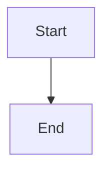

# md2word — Markdown to Word Converter

> Chinese version: [README.md](README.md)

Convert Markdown documents to professionally formatted Word (.docx) files using customizable style templates. Supports images (local/URL), tables, code syntax highlighting, math formulas, Mermaid diagrams, task lists, table of contents, heading numbering, and more.

## Installation

```bash
pip install -e .
# Optional enhancements:
pip install -e ".[highlight]"   # Code syntax highlighting (Pygments)
pip install -e ".[math]"        # Math formula rendering (matplotlib)
pip install -e ".[svg]"         # SVG support (resvg)
pip install -e ".[all]"         # All features
```

Requires Python 3.10+.

## Usage

```bash
# Basic conversion
md2word input.md -o output.docx

# Custom template
md2word input.md -t my-template.docx -o output.docx

# Batch convert (multiple files)
md2word chapter1.md chapter2.md chapter3.md

# List available themes
md2word --list-themes

# Generate a template for customization
md2word --create-template my-template.docx --theme academic

# Validate template completeness
md2word --validate-template my-template.docx

# Inspect template styles
md2word --list-styles -t my-template.docx
```

Also reads from stdin:

```bash
cat document.md | md2word -o output.docx
```

## New Features

### Table of Contents
```bash
md2word input.md --toc --toc-depth 1-3
```
Inserts a Word TOC field at the beginning of the document. Press Ctrl+A → F9 in Word to update. Use `--no-toc` to disable.

### Code Syntax Highlighting
```bash
md2word input.md  # auto-enabled with Pygments
md2word input.md --no-highlight  # disable
```
Detects language and applies colored highlighting for 200+ languages. Keywords are bold, comments italic, strings/numbers/keywords colored distinctly.

### Math Formulas
```bash
md2word input.md  # auto-enabled with matplotlib
md2word input.md --no-math  # disable
```
Supports `$...$` inline and `$$...$$` block formulas:
- `$E = mc^2$` → inline rendering
- `$$\sum_{i=1}^{n} i = \frac{n(n+1)}{2}$$` → block rendering

Rendered as SVG for crisp scaling.

### Mermaid Diagrams
````markdown

````
```bash
md2word input.md  # auto-enabled
md2word input.md --no-mermaid  # disable
```
Rendered via mermaid.ink API (no local install required) or `mmdc` CLI locally.

### Heading Numbering
```bash
md2word input.md --number-headings
```
Adds hierarchical numbering (1, 1.1, 1.1.1, ...) for academic and technical documents.

### Page Breaks
```bash
md2word input.md --page-break
```
Inserts page breaks before each H1 heading.

### Batch Conversion
```bash
md2word doc1.md doc2.md doc3.md
```
Convert multiple files at once, each gets a same-name `.docx` file.

### Template Validation
```bash
md2word --validate-template my-template.docx
```
Checks for all required guide paragraphs and recommends optional ones.

## How It Works

The tool uses **guide paragraphs** in the template docx. Each guide paragraph has a keyword that tells the tool what style element it represents. The tool reads the **formatting** (font, size, color, alignment, indentation) and applies it to matching markdown content.

| Keyword | Slot | Markdown Element |
|---------|------|-----------------|
| 一级标题 | h1 | `# heading` |
| 二级标题 | h2 | `## heading` |
| 三级标题 | h3 | `### heading` |
| 正文 | body | Normal paragraph |
| 首行缩进 | body_indent | Body with first-line indent |
| 图片 | image | Image container |
| 图注 | figcaption | Image caption (alt text) |
| 引用 | quote | `> blockquote` |
| 代码 | code | Code block |
| 无序列表 | bullet_list | `- item` (unordered) |
| 有序列表 | number_list | `1. item` (ordered) |
| 目录标题 | toc_title | TOC title |

**To customize**: open a generated template in Word, format the guide paragraphs, and save. The tool detects your changes automatically.

## Built-in Themes

### 官方公文 (Official Document)
- FangSong body, SimHei headings, 16pt, 1.5 line spacing
- Margins: top 3.7cm/bottom 3.5cm/left 2.8cm/right 2.6cm

### 学术论文 (Academic Paper)
- SimSong throughout, SimHei centered headings
- First-line indent 2 chars, 1.5 line spacing
- Standard academic margins

### 技术文档 (Technical Documentation)
- Microsoft YaHei, deep blue hierarchical headings
- Monospace code (Consolas + DengXian)
- Compact layout, high information density

### 自媒体排版 (Social Media / We-Media)
- Large headings (32pt), brand orange accents
- 1.8x line spacing, generous margins
- KaiTi large-size quotes

## Full CLI Reference

| Flag | Description |
|------|-------------|
| `inputs` | Input Markdown file(s) |
| `-o, --output` | Output .docx path |
| `-t, --template` | Template .docx path |
| `--image-width` | Max image width in inches (default 5.5) |
| `--toc / --no-toc` | Enable/disable TOC |
| `--toc-depth` | TOC heading depth (e.g. `1-3`) |
| `--number-headings` | Auto-number headings |
| `--page-break` | Page break before H1 |
| `--no-highlight` | Disable syntax highlighting |
| `--no-math` | Disable math formulas |
| `--no-mermaid` | Disable Mermaid diagrams |
| `--create-template` | Generate template file |
| `--theme` | Template theme |
| `--list-themes` | List available themes |
| `--list-styles` | Inspect template styles |
| `--validate-template` | Validate template |
| `--version` | Show version |

## Features

- **Images**: Local and URL images auto-downloaded, resized to fit page
- **Captions**: Image alt text placed as centered caption below images
- **Task lists**: `[x]` and `[ ]` rendered as ☑ / ☐ checkboxes
- **Tables**: Markdown tables with clean light borders
- **Nested lists**: Infinite nesting for bullet and numbered lists
- **Code blocks**: Monospace font with optional syntax highlighting (Pygments)
- **Blockquotes**: Complete preservation with inline formatting
- **Math formulas**: LaTeX → SVG rendering (matplotlib)
- **Mermaid diagrams**: Flowcharts, sequence diagrams, etc. as SVG
- **Table of contents**: Auto-generated Word TOC field
- **Heading numbering**: Multi-level automatic numbering
- **Inline formatting**: Bold, italic, code, links preserved
- **Chinese fonts**: All East-Asian fonts explicitly set (no MS Mincho fallback)
- **Paragraph breaks**: Newlines in Markdown become paragraph marks (^p), not soft breaks
- **Conversion report**: Summary of warnings and errors after conversion

## Project Structure

```
src/md2word/
├── cli.py              — CLI: argument parsing, 4 theme templates
├── converter.py        — Core: MD → HTML → docx with style extraction
├── template.py         — Style extraction + template validation
├── image_utils.py      — Image download, resize, embed
├── syntax.py           — Code syntax highlighting (Pygments)
├── math_renderer.py    — Math formula rendering (matplotlib → SVG)
├── mermaid_renderer.py — Mermaid diagram rendering (API / mmdc)
template/
├── 官方公文.docx
├── 学术论文.docx
├── 技术文档.docx
└── 自媒体排版.docx
```

## License

MIT
