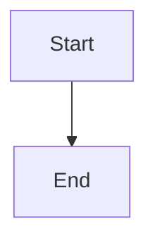

# md2word — Markdown to Word Converter

> Chinese version: [README.md](README.md)

Convert Markdown documents to professionally formatted Word (.docx) files using customizable style templates. **Natively supports Chinese document standards** — government documents (GB/T 9704-2012), academic papers, and red-head official documents — no LaTeX, no CSS, no manual layout.

```bash
pip install -e ".[all]"
md2word article.md -o article.docx               # auto-detect built-in themes
md2word notice.md --redhead "XX Municipality"    # one-click red-head document
```

---

## Why md2word?

### Chinese-first Design

Chinese document formatting has unique requirements — government documents require FangSong font at 16pt with 37mm top margin, academic papers require SimSun at 12pt with first-line indent. md2word handles these out of the box:

| Feature | Pandoc / General Tools | md2word |
|---------|----------------------|---------|
| **Red-head documents** | Not supported or manual assembly | `--redhead "Authority"` one-click |
| **Government format** | Requires custom LaTeX template | Built-in GB/T 9704-2012 theme |
| **East-Asian fonts** | May fall back to Japanese/Korean | Explicitly sets SimSun/SimHei/FangSong/KaiTi |
| **Three-line table** | Requires manual styling | `--three-line-table` one switch |
| **Math formulas** | Convert to images or manual MathML | LaTeX → OMML native editable formulas |
| **Cross-references** | Requires Pandoc filter | Markdown links → Word REF fields |
| **Incremental conversion** | Not supported | Built-in (MD5 hash cache) |
| **Version update check** | Not supported | Built-in (GitHub releases) |
| **Watch mode** | Not supported | Built-in |

### Template System: Edit in Word, Tool Understands

A md2word template is **just a .docx file** — open it in Word, format the guide paragraphs (like "一级标题", "正文"), save, and the tool automatically uses your styles. No coding required.

---

## Installation

Requires Python 3.10+.

```bash
# Core installation
pip install -e .

# All optional features
pip install -e ".[all]"
```

Optional dependencies:

| Component | Command | Feature |
|-----------|---------|---------|
| Code highlighting | `pip install -e ".[highlight]"` | Pygments syntax coloring |
| Math formulas | `pip install -e ".[math]"` | LaTeX → OMML editable formulas |
| SVG support | `pip install -e ".[svg]"` | Native SVG embedding |
| Config / Watch | `pip install -e ".[all]"` | YAML config + Watch mode |

Check status:

```bash
md2word --check-deps
```

---

## Quick Start

```bash
# Basic conversion (auto-detect built-in theme)
md2word input.md -o output.docx

# Specify theme
md2word article.md --theme academic -o article.docx

# Custom template
md2word article.md -t my-template.docx -o article.docx

# Batch conversion
md2word chapter1.md chapter2.md chapter3.md

# Stdin
cat document.md | md2word -o output.docx
```

---

## Built-in Themes

| Theme | Use Case | Style |
|-------|----------|-------|
| `academic` | Thesis, journal papers | SimSong + SimHei centered headings + first-line indent |
| `academic-plus` | Academic (enhanced) | Same as academic + abstract/keywords/references slots |
| `official` | Government documents | FangSong 16pt + SimHei headings + GB/T 9704-2012 margins |
| `tech` | Technical docs, API manuals | Microsoft YaHei + deep blue headings + Consolas code |
| `media` | Social media, newsletters | Large headings (32pt) + orange accent + 1.8x line spacing |
| `redhead` | **Red-head documents** | GB/T 9704-2012 + red header + SimHei headings + FangSong body |

---

## Feature Guide

### Table of Contents & Heading Numbering

```bash
md2word doc.md --toc --toc-depth 1-3 --number-headings --page-break
```

- `--toc`: Insert Word TOC field (Ctrl+A → F9 to update)
- `--toc-depth 1-3`: Include heading levels 1-3
- `--number-headings`: Auto-number headings (1, 1.1, 1.1.1...)
- `--page-break`: Page break before each H1

### YAML Front Matter

```yaml
---
title: Paper Title
author: Author Name
date: 2026-05-27
abstract: This is an abstract.
keywords: keyword1, keyword2
---
```

- `title` / `author` / `date` → written to docx built-in properties
- `abstract` / `keywords` → rendered as styled paragraphs (with academic-plus theme)

### Extended Markdown Syntax

```markdown
~~strikethrough~~      →  strikethrough formatting
==highlight==          →  yellow highlight
X^2^                   →  superscript
H~2~O                  →  subscript
- [x] completed        →  ☑ checkbox
- [ ] pending          →  ☐ checkbox
```

### Footnotes

```markdown
Standard syntax[^1], converted to Word native footnotes.

[^1]: Footnote content, can span multiple lines.
```

### Cross-References

```markdown
See [Data Overview](#data-overview).       → Word REF field
Refer to [Table 1](#table-1).             → Table reference
See [Figure 1](#figure-1).                → Figure reference
```

Press Ctrl+A → F9 in Word to update all fields.

### Math Formulas

```markdown
Inline: $E = mc^2$
Block: $$\sum_{i=1}^{n} i = \frac{n(n+1)}{2}$$
```

- Requires: `pip install -e ".[math]"`
- Converts to **Word OMML** (natively editable — double-click to modify in Word)
- Falls back to SVG rendering via matplotlib if OMML conversion fails

### Mermaid Diagrams

````markdown

````

- Rendered via mermaid.ink API (no local install) or local `mmdc` CLI
- Output as embedded SVG in docx

### Three-Line Table

```bash
md2word paper.md --three-line-table
```

Academic style: thick top/bottom borders, header underline, no vertical borders.

### Images

```markdown


```

- Supports local paths and URLs (auto-downloaded)
- Auto-scaled to fit (`--image-width`, default 5.5 inches)
- SVG: native embedding (requires `resvg`) or PNG fallback

### Incremental Conversion

```bash
md2word ch1.md ch2.md ch3.md --incremental
```

MD5 content hash caching — skips unchanged files on subsequent runs.

### GB Compliance Check

```bash
md2word notice.md --theme official --gb-check
```

Validates margins and fonts against GB/T 9704-2012 standard.

### Style Mapping

Override default style slots via config:

```yaml
# md2word.yaml
style_map:
  code: CustomCodeStyle
  quote: CustomQuoteStyle
```

### Page Numbering

```bash
md2word doc.md --page-number "-- %d --"
```

Centered footer page numbers with custom format (`%d` is the page number placeholder).

### Project-Level Config

```
project/
├── .md2word/
│   ├── config.yaml       # Auto-loaded project config
│   └── template.docx     # Auto-detected project template
├── src/
└── article.md
```

Config priority: `.md2word/config.yaml` > `md2word.yaml` > `md2word.yml` > `md2word.json` > `pyproject.toml`

```yaml
# .md2word/config.yaml
theme: academic
toc: true
number-headings: true
style_map:
  code: CustomCode
verbose: false
update-check: true
```

### Version Update Check

After each successful conversion, checks GitHub for newer releases:

```
  ✅ Conversion complete, no warnings or errors

  📦 New version available: v1.8.0 → v1.9.0
     Update: pip install --upgrade md2word
     https://github.com/lsqkk/md2word/releases
```

- Results cached for 24 hours
- Disable with `--no-update-check` or `update-check: false` in config

### Watch Mode

```bash
md2word doc.md --watch
```

Auto-reconvert on file changes. Uses watchdog (efficient) or polling (fallback).

### Verbose Mode

```bash
md2word doc.md --verbose
```

Shows each conversion stage (template parsing, footnote processing, math rendering, block progress).

---

## Custom Template System

**No coding required.** Create a .docx, insert guide paragraph keywords, format them, save:

| Guide Paragraph | Slot | Markdown Element |
|-----------------|------|-----------------|
| 一级标题 | h1 | `# heading` |
| 二级标题 | h2 | `## heading` |
| 三级标题 | h3 | `### heading` |
| 四级标题 | h4 | `#### heading` |
| 五级标题 | h5 | `##### heading` |
| 正文 | body | Normal paragraph |
| 首行缩进 | body_indent | Body with first-line indent |
| 图片 | image | Image container |
| 图注 | figcaption | Image caption |
| 引用 / quote | quote | `> blockquote` |
| 代码 / code block | code | Code block |
| 无序列表 / bullet list | bullet_list | `- item` |
| 有序列表 / ordered list | number_list | `1. item` |
| 目录标题 / table of contents | toc_title | TOC title |
| 摘要 / abstract | abstract | Frontmatter abstract |
| 关键词 / keywords | keywords | Frontmatter keywords |
| 参考文献 / references | references | References section |

Generate starter templates:

```bash
# Generate from academic theme
md2word --create-template my-template.docx --theme academic

# Validate template
md2word --validate-template my-template.docx

# Inspect detected styles
md2word --list-styles -t my-template.docx
```

---

## Full CLI Reference

| Flag | Description |
|------|-------------|
| `inputs` | Input Markdown file(s, supports glob patterns) |
| `-o, --output` | Output .docx path |
| `--out-dir` | Output directory for batch conversion |
| `-t, --template` | Template .docx path |
| `--theme` | Built-in theme (academic / academic-plus / official / tech / media / redhead) |
| `--image-width` | Max image width in inches (default 5.5) |
| `--toc / --no-toc` | Enable/disable TOC |
| `--toc-depth` | TOC heading depth (e.g. `1-3`) |
| `--number-headings` | Auto-number headings |
| `--page-break` | Page break before H1 |
| `--three-line-table` | Three-line table style |
| `--no-footnotes` | Disable footnotes |
| `--no-highlight` | Disable syntax highlighting |
| `--no-math` | Disable math formulas |
| `--no-mermaid` | Disable Mermaid diagrams |
| `--no-update-check` | Disable version update check |
| `--redhead` | Red-head document authority name |
| `--redhead-year` | Red-head document year |
| `--redhead-number` | Red-head document number |
| `--page-number` | Page number format (e.g. `-- %d --`) |
| `--gb-check` | GB compliance check |
| `--incremental` | Incremental conversion (content hash) |
| `--project-dir` | Project root directory |
| `--config` | Config file path |
| `--watch` | Watch for changes and auto-reconvert |
| `--verbose` | Show detailed conversion progress |
| `--create-template` | Generate template file |
| `--validate-template` | Validate template completeness |
| `--list-styles` | Inspect template styles |
| `--list-themes` | List available themes |
| `--check-deps` | Check optional dependencies |
| `--version` | Show version |

---

## How It Works

```
Markdown → HTML → Block dispatch → Style extraction → python-docx → .docx
                              ↕
              Footnotes/Math/Mermaid/Code highlighting
```

The key innovation is the **style extraction mechanism**: instead of defining styles in code, it reads paragraph formatting directly from a Word template. Open template → format guide paragraphs → save → md2word uses your styles automatically.

---

## Project Structure

```
src/md2word/
├── cli.py              — CLI entry, arg parsing, watch mode
├── converter.py        — Conversion orchestration
├── handlers.py         — Block handlers (headings, paragraphs, lists, tables, code)
├── ooxml_helpers.py    — OOXML operations (bookmarks, fields, SVG, numbering)
├── metadata.py         — Post-processing (red-head, GB check, page numbers)
├── context.py          — ConversionContext + ConversionReport
├── frontmatter.py      — YAML frontmatter parsing and docx properties
├── cache.py            — Incremental conversion cache (MD5 hash)
├── config.py           — Config file loading (YAML/JSON/TOML)
├── template.py         — Style extraction + template validation
├── themes.py           — 6 built-in theme definitions
├── options.py          — ConvertOptions dataclass
├── update_check.py     — GitHub version update check
├── footnotes.py        — Footnote extraction and insertion
├── image_utils.py      — Image download, resize, SVG parsing
├── syntax.py           — Pygments syntax highlighting
├── math_omml.py        — LaTeX → Word OMML conversion
├── math_renderer.py    — LaTeX → SVG rendering (matplotlib fallback)
├── mermaid_renderer.py — Mermaid → SVG (API / mmdc)
template/
├── 官方公文.docx         official theme
├── 学术论文.docx         academic theme
├── 技术文档.docx         tech theme
├── 自媒体排版.docx       media theme
```

## Tech Stack

Python 3.10+, python-docx, markdown, Pillow, requests, PyYAML, Pygments, matplotlib, watchdog

## Version History

### v1.9.0
- **Version update check**: Auto-check GitHub for new releases after conversion, 24h cache, `--no-update-check` to disable
- **Config support**: `update-check: false` in config file
- 251 tests, all passing

### v1.8.0
- **ConvertOptions dataclass**: `convert()` accepts single config object instead of 14+ kwargs
- **Config system upgrade**: PyYAML hard dependency, nested config support
- **Template XML markers**: Machine-readable slot IDs via `<w:customXml>`
- **Verbose mode**: `--verbose` shows stage-by-stage progress
- **Error context**: Block errors include 80-char text preview
- 39 new tests, 2450 total test lines

### v1.6.0
- **Abstract/keywords rendering**: YAML frontmatter rendered as document paragraphs
- **Bookmark conflict fix**: Duplicate headings get `-1`, `-2` suffixes
- **`style_map` implemented**: Custom Markdown-to-Word-style mapping
- **Red-head configurable**: `--redhead-year` and `--redhead-number` flags
- **Code block whitespace preserved**: `text.strip('\n')` retains intentional indentation
- 61 new tests

### v1.5.0
- **Architecture refactor**: `converter.py` split into 6 modules
- **ConversionContext**: Global state encapsulated, batch-safe
- **ConversionReport**: Severity levels (info/warning/error/critical)
- **New syntax**: `~~strikethrough~~`, `==highlight==`, `^sup^`, `~sub~`
- **Task lists**: `- [x]` / `- [ ]` with nested support
- **YAML frontmatter**: title/author/date → docx properties
- **Cross-references**: `[text](#anchor)` → Word REF fields
- **`--out-dir`**: Batch output directory
- **Glob patterns**: `md2word "docs/**/*.md"`

### v1.3.0
- **Red-head documents**: `--redhead AUTHORITY` one-click generation
- **GB compliance check**: `--gb-check` against GB/T 9704-2012
- **Page numbering**: `--page-number FMT`
- **Incremental conversion**: `--incremental` MD5 hash cache
- **Project-level config**: `.md2word/config.yaml` auto-detection
- **New themes**: academic-plus and redhead
- **ConversionReport**: Structured return value
- 107 tests

## Agent Skill Docs

The `skills/md2word/` directory contains multi-module skill documentation for AI agents (e.g. Claude Code), organized by function for on-demand reading:

| File | Content | Trigger |
|------|---------|---------|
| `INDEX.md` | Index and usage guide | First read |
| `01-install.md` | Installation guide | User asks about install |
| `02-commands.md` | CLI command reference | User asks about usage |
| `03-themes.md` | Built-in themes | User asks about themes |
| `04-template.md` | Template system | User asks about custom styles |
| `05-syntax.md` | Markdown syntax | User asks about syntax support |
| `06-config.md` | Configuration | User asks about config |
| `07-redhead.md` | Red-head template | User asks about red-head docs |
| `08-version-history.md` | Version history | User asks about changelog |

**For agent users:**
- Installation paths in these files (e.g. `D:/git/lsqkk/md2word`) must be adjusted to actual install location
- After project updates, sync `skills/md2word/` to `skills` or `tools` -> `md2word/` directory

## License

MIT
