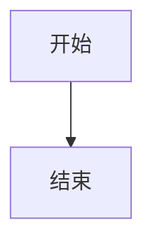

# md2word — Markdown 转 Word 文档工具

> 中文 | [English](README-en.md)

将 Markdown 文档转换为符合中国文档标准的 Word (.docx) 文件，**原生支持党政机关公文格式（GB/T 9704-2012）、学术论文格式、红头文件生成**——无需 LaTeX、无需 CSS、无需手动排版。

```bash
pip install -e ".[all]"
md2word 文章.md -o 文章.docx                     # 自动识别内置主题
md2word 通知.md --redhead "XX市人民政府"          # 一键生成红头文件
```

---

## 为什么选择 md2word？

### 直面中文排版的真实痛点

中文文档排版有独特的规范体系——公文有 GB/T 9704-2012（仿宋三号正文、37mm 上边距），学术论文有标准格式（宋体小四、首行缩进两字符），这些格式在 Pandoc、LaTeX 等通用工具中配置复杂且容易出错。md2word 从设计之初就以中文规范为第一优先级：

| 场景 | 通用工具的做法 | md2word 的做法 |
|------|--------------|---------------|
| **红头文件** | 不支持或需手动拼接 | `--redhead "XX单位"` 一键生成（红头 + 分隔线 + 文号） |
| **公文格式** | 需手写 LaTeX 模板 | 内置 GB/T 9704-2012 标准主题，开箱即用 |
| **东亚字体** | 易回退为日文/韩文字体 | 显式指定 SimSun/SimHei/FangSong/KaiTi，杜绝字体回退 |
| **三线表** | 需手写表格样式 | `--three-line-table` 一键切换 |
| **公式** | 转图片或需 MathML 手写 | LaTeX → OMML 原生可编辑公式 |
| **交叉引用** | 需 Pandoc 过滤器 | Markdown 内链 → Word REF 域 |

### 模板系统：在 Word 里改格式，工具自动理解

大多数文档工具的模板需要写代码（LaTeX 模板、CSS 样式表、Pandoc filters）。md2word 的模板就是 **一个普通的 .docx 文件**——打开它，修改引导段落（如"一级标题""正文"）的字体、字号、颜色，保存后用新模板转换即可。

### 与 Pandoc 的对比

| 能力 | md2word | Pandoc |
|------|---------|--------|
| **安装** | 纯 Python, `pip install` | Haskell 生态，较重型 |
| **模板修改** | 打开 Word 改格式 | 需写 LaTeX/自定义 writer |
| **中文规范** | 内置 GB 标准 + 东亚字体策略 | 依赖外部模板配置 |
| **红头文件** | `--redhead` 一键生成 | 不支持 |
| **公式** | OMML 原生可编辑 | 需 `--reference-docx` |
| **Mermaid** | 内建渲染 | 需外部预处理 |
| **三线表** | `--three-line-table` | 需自定义模板 |
| **增量转换** | 内建（内容哈希缓存） | 无 |
| **版本更新通知** | 内建（自动检查 GitHub） | 无 |
| **Watch 模式** | 内建 | 无 |
| **PDF 输出** | 不支持（定位是 Word 专用） | 内建 |

---

## 安装

需要 Python 3.10+。

```bash
# 从项目根目录安装
pip install -e .

# 安装全部可选增强
pip install -e ".[all]"
```

可选依赖：

| 组件 | 安装命令 | 功能 |
|------|---------|------|
| 代码高亮 | `pip install -e ".[highlight]"` | Pygments 语法着色 |
| 数学公式 | `pip install -e ".[math]"` | LaTeX → OMML 原生可编辑公式 |
| SVG 支持 | `pip install -e ".[svg]"` | 原生 SVG 嵌入 |
| 配置/监听 | `pip install -e ".[all]"` | YAML 配置 + Watch 模式 |

查看可用组件：

```bash
md2word --check-deps
```

---

## 快速开始

```bash
# 基本转换（自动搜索内置主题）
md2word 文章.md -o 文章.docx

# 指定主题
md2word 文章.md --theme academic -o 文章.docx

# 使用自定义模板
md2word 文章.md -t 我的模板.docx -o 文章.docx

# 批量转换——自动为每个 .md 生成同名 .docx
md2word 第一章.md 第二章.md 第三章.md

# 标准输入
cat 文章.md | md2word -o 文章.docx
```

---

## 内置主题（6 套）

| 主题 | 适用场景 | 风格特征 |
|------|---------|---------|
| `academic` | 学位论文、期刊投稿 | 宋体系列 + 黑体标题居中 + 首行缩进 + 标准学术版心 |
| `academic-plus` | 学术论文（增强版） | 在 academic 基础上增加摘要/关键词/参考文献引导段落 |
| `official` | 政府公文 | 仿宋三号正文 + 黑体标题 + GB/T 9704-2012 标准页边距 |
| `tech` | 技术文档、API 手册 | 微软雅黑 + 深蓝层级标题 + 紧凑排版 + Consolas 代码 |
| `media` | 公众号、自媒体 | 大号标题(32pt) + 橙色品牌色 + 1.8 倍高行距 + 楷体引用 |
| `redhead` | **红头文件** | GB/T 9704-2012 标准 + 红头样式 + 黑体标题 + 仿宋正文 |

---

## 红头文件

```bash
# 一键生成
md2word 通知.md --redhead "XX市人民政府" --theme redhead

# 自定义文号年份和编号
md2word 通知.md --redhead "XX市人民政府" --redhead-year 2026 --redhead-number 12
```

自动生成：
- **红色发文机关名称**（28pt 宋体, #CC0000）+ "文件" 后缀
- **红色分隔线**（满宽）
- **公文文号**（如"XX市人民政府 文件〔2026〕12号"）
- GB/T 9704-2012 标准页边距（上 37mm、下 35mm、左 28mm、右 26mm）

---

## 功能详解

### 目录与标题编号

```bash
md2word 文档.md --toc --toc-depth 1-3 --number-headings --page-break
```

- `--toc`：在文档开头插入 Word 目录域（Ctrl+A → F9 更新）
- `--toc-depth 1-3`：目录包含 1~3 级标题
- `--number-headings`：标题自动编号（1, 1.1, 1.1.1...）
- `--page-break`：每个一级标题前插入分页符

### YAML 前置元数据

在 Markdown 文件开头用 `---` 包裹元数据，自动映射到 Word 文档属性：

```yaml
---
title: 论文标题
author: 作者名
date: 2026-05-27
abstract: 这是一篇关于某某研究的论文。
keywords: 关键词1, 关键词2
---
```

- `title` / `author` / `date` → 写入 docx 内置属性（文件 → 信息中可见）
- `abstract` / `keywords` → 使用 academic-plus 主题时渲染为摘要/关键词段落

### 扩展 Markdown 语法

```markdown
~~删除线~~         →  ~~删除线~~（Word 删除线格式）
==高亮==           →  ==黄色高亮==（Word 高亮标记）
X^2^               →  上标
H~2~O              →  下标
- [x] 已完成       →  ☑ 复选框
- [ ] 未完成       →  ☐ 复选框
```

### 脚注

```markdown
Markdown 标准语法[^1]，自动转为 Word 原生脚注。

[^1]: 这是脚注内容，可跨多行。
    续行缩进 2 个空格即可。
```

### 交叉引用

```markdown
参考[数据说明](#数据说明)。      → 生成 Word REF 域
详细设置见[表1](#表1)。          → 引用表格
请参见[图1](#图1)。              → 引用图片
```

在 Word 中按 Ctrl+A → F9 更新域，自动填充编号。

### 数学公式

```markdown
内联公式：$E = mc^2$
块级公式：$$\sum_{i=1}^{n} i = \frac{n(n+1)}{2}$$
```

- 依赖：`pip install -e ".[math]"`（matplotlib + latex2mathml）
- 转换为 **Word OMML**（原生可编辑公式，在 Word 中双击可修改）
- latex2mathml 解析失败时回退为 matplotlib 渲染的 SVG

### Mermaid 图表

````markdown

````

- 默认通过 http://mermaid.ink/ API 渲染（无需本地安装）
- 可选本地 `mmdc` CLI 渲染
- 输出为 SVG 嵌入 docx

### 三线表

```bash
md2word 论文.md --three-line-table
```

学术期刊风格表格：顶线/底线加粗、表头下线、无竖线。

### 表格与图片

```markdown
| 列1 | 列2 | 列3 |
|-----|-----|-----|
| A   | B   | C   |


```

- 表格：默认清晰边框，`--three-line-table` 切换学术风格
- 图片：支持本地路径和 URL，自动下载，自动缩放（`--image-width` 控制宽度，默认 5.5 英寸）
- SVG 图片：原生嵌入 docx（需要 `resvg`）或回退为 PNG

### 增量转换

```bash
md2word 第一章.md 第二章.md 第三章.md --incremental
```

基于 MD5 内容哈希的智能跳过机制——首次完整转换，后续只处理内容变化的文件。

### GB 标准合规检查

```bash
md2word 通知.md --theme official --gb-check
```

自动检测文档格式是否符合 GB/T 9704-2012 党政机关公文格式标准：

```
  ⚠  GB/T 9704-2012 公文上边距应为 37mm，当前 30.0mm
```

### 样式映射

通过配置文件或代码自定义 Markdown 元素对应的 Word 样式：

```yaml
# md2word.yaml
style_map:
  code: CustomCodeStyle     # 代码块使用名为"CustomCodeStyle"的样式
  quote: 引用块              # 引用使用自定义样式
```

### 页码格式

```bash
md2word 文档.md --page-number "-- %d --"
```

在页脚居中插入页码，支持任意格式（`%d` 为页码占位符）。

### 项目级配置

在项目根目录创建 `.md2word/` 文件夹：

```
项目目录/
├── .md2word/
│   ├── config.yaml       # 项目级配置（自动加载）
│   └── template.docx     # 项目级模板（自动识别）
├── src/
└── 文章.md
```

配置查找优先级：`.md2word/config.yaml` > `md2word.yaml` > `md2word.yml` > `md2word.json` > `pyproject.toml`

```yaml
# .md2word/config.yaml
theme: academic
toc: true
toc-depth: 1-3
number-headings: true
three-line-table: true
style_map:
  code: CustomCode
verbose: false           # 显示详细转换过程
update-check: true       # 启用版本更新检查
```

### 版本更新检查

每次转换成功后，自动检查 GitHub 上是否有新版本：

```
  ✅ 转换完成，无警告或错误

  📦 新版本可用: v1.8.0 → v1.9.0
     更新: pip install --upgrade md2word
     https://github.com/lsqkk/md2word/releases
```

- 结果缓存 24 小时，避免 API 限速
- 使用 `--no-update-check` 禁用
- 或在配置文件中设置 `update-check: false`

### Watch 模式

```bash
md2word 文章.md --watch
```

文件变化后自动重新转换，适合写作时实时预览。支持 watchdog（高效）和 polling（回退）两种模式。

### 详细输出模式

```bash
md2word 文章.md --verbose
```

显示转换各阶段的进度信息（模板解析、脚注预处理、数学公式渲染、块处理进度等），便于排查问题。

---

## 自定义模板

**不需要写代码。** 在 Word 中新建 docx，插入以下关键词段落，调整格式，保存即可：

| 引导段落 | 对应元素 |
|---------|---------|
| 一级标题 | `# 标题` |
| 二级标题 | `## 标题` |
| 三级标题 | `### 标题` |
| 四级标题 | `#### 标题` |
| 五级标题 | `##### 标题` |
| 正文 | 普通段落 |
| 首行缩进 | 首行缩进的正文 |
| 图片 | 图片容器 |
| 图注 | 图片说明（alt 文本） |
| 引用 | `> 引用块` |
| 代码 | 代码块 |
| 无序列表 | `- 列表项` |
| 有序列表 | `1. 列表项` |
| 目录标题 | 目录上方标题 |
| 摘要 | YAML frontmatter `abstract` 标签 |
| 关键词 | YAML frontmatter `keywords` 标签 |
| 参考文献 | 参考文献段落 |

工具的检测规则：按段落**从头到尾**匹配关键词，**先匹配到的优先**。

快速生成模板：

```bash
# 基于学术主题生成模板
md2word --create-template 我的模板.docx --theme academic

# 验证模板完整性
md2word --validate-template 我的模板.docx

# 查看模板识别的样式
md2word --list-styles -t 我的模板.docx
```

---

## 全部 CLI 参数

| 参数 | 说明 |
|------|------|
| `inputs` | 输入 Markdown 文件（支持多个和 glob 模式） |
| `-o, --output` | 输出 .docx 路径 |
| `--out-dir` | 批量输出目录 |
| `-t, --template` | 模板 .docx 文件 |
| `--theme` | 内置主题名（academic / academic-plus / official / tech / media / redhead） |
| `--image-width` | 图片最大宽度（英寸，默认 5.5） |
| `--toc / --no-toc` | 启用/禁用目录 |
| `--toc-depth` | 目录深度（如 `1-3`） |
| `--number-headings` | 标题自动编号 |
| `--page-break` | H1 前插入分页符 |
| `--three-line-table` | 三线表样式 |
| `--no-footnotes` | 禁用脚注 |
| `--no-highlight` | 禁用代码高亮 |
| `--no-math` | 禁用数学公式 |
| `--no-mermaid` | 禁用 Mermaid 图表 |
| `--no-update-check` | 禁用版本更新检查 |
| `--redhead` | 红头文件发文机关名称 |
| `--redhead-year` | 红头文件文号年份 |
| `--redhead-number` | 红头文件文号编号 |
| `--page-number` | 页码格式（如 `-- %d --`） |
| `--gb-check` | GB 标准合规检查 |
| `--incremental` | 增量转换（内容哈希缓存） |
| `--project-dir` | 项目根目录 |
| `--config` | 指定配置文件路径 |
| `--watch` | 监听文件变化自动转换 |
| `--verbose` | 显示详细转换过程 |
| `--create-template` | 生成模板文件 |
| `--validate-template` | 验证模板完整性 |
| `--list-styles` | 查看模板样式 |
| `--list-themes` | 列出可用主题 |
| `--check-deps` | 检查依赖完整性 |
| `--version` | 显示版本号 |

---

## 依赖关系

| 特性 | 依赖 | 可选 |
|------|------|------|
| 核心转换 | python-docx, markdown, Pillow | 否 |
| 代码高亮 | Pygments | 是 |
| 数学公式 | matplotlib, latex2mathml | 是 |
| SVG 嵌入 | resvg | 是 |
| Watch 模式 | watchdog | 是（无 watchdog 时自动降级为 polling） |
| YAML 配置 | PyYAML | 是 |

---

## 工作原理

```
Markdown → HTML → 按块分派 → 模板样式提取 → python-docx 构建 → .docx
                           ↕
                   脚注/公式/Mermaid/代码高亮
```

工具的独特之处在于**样式提取机制**：不是用代码定义格式，而是从 Word 模板中读取已存在的段落样式。打开模板 docx → 修改引导段落格式 → 保存 → md2word 自动使用新样式。

---

## 项目结构

```
src/md2word/
├── cli.py              — CLI 入口、参数解析、Watch 模式
├── converter.py        — 核心转换管道（编排各模块）
├── handlers.py         — 块处理器（标题/段落/列表/表格/代码等）
├── ooxml_helpers.py    — OOXML 底层操作（书签/域/SVG/列表编号）
├── metadata.py         — 后处理（红头文件/GB 检查/页码/引导段移除）
├── context.py          — ConversionContext + ConversionReport
├── frontmatter.py      — YAML frontmatter 解析与 docx 属性写入
├── cache.py            — 增量转换缓存（MD5 哈希）
├── config.py           — 配置文件加载（YAML/JSON/TOML）
├── template.py         — 引导段落样式提取 + 模板验证
├── themes.py           — 6 套内置主题定义 + 模板生成
├── options.py          — ConvertOptions 配置数据类
├── update_check.py     — GitHub 版本更新检查
├── footnotes.py        — 脚注提取 + Word 原生脚注写入
├── image_utils.py      — 图片下载、缩放、SVG 处理
├── syntax.py           — Pygments 语法高亮
├── math_omml.py        — LaTeX → Word OMML 转换
├── math_renderer.py    — LaTeX → SVG 渲染（matplotlib 回退）
├── mermaid_renderer.py — Mermaid → SVG（API / mmdc）
template/
├── 学术论文.docx         academic theme
├── 官方公文.docx         official theme
├── 技术文档.docx         tech theme
├── 自媒体排版.docx       media theme
```

## 技术栈

Python 3.10+, python-docx, markdown, Pillow, requests, PyYAML, Pygments, matplotlib, watchdog

## 版本历史

### v1.9.0
- **版本更新检查**：转换成功后自动检查 GitHub 新版本，24h 缓存，`--no-update-check` 可禁用
- **配置支持**：`update-check: false` 在配置文件中禁用更新检查
- 251 个测试，全部通过

### v1.8.0
- **ConvertOptions 数据类**：`convert()` 接受单一配置对象替代 14+ 个关键字参数
- **配置系统升级**：PyYAML 硬依赖，支持嵌套配置（style_map、列表等）
- **模板自定义 XML 标记**：`<w:customXml>` 注入机器可读的样式槽标识，消除文本匹配误判
- **Verbose 模式**：`--verbose` 显示转换全流程进度
- **错误上下文**：块处理错误包含前 80 字符文本预览，便于定位问题
- 39 个新测试，累计 2450 行测试代码

### v1.6.0
- **抽象/关键词渲染**：YAML frontmatter 的 abstract/keywords 渲染为文档段落（使用模板样式槽）
- **书签冲突修复**：重复标题自动追加 `-1`、`-2` 后缀，消除 Word 书签错误
- **`style_map` 实现**：自定义 Markdown 元素到 Word 样式的映射
- **红头文号可配置**：`--redhead-year` 和 `--redhead-number` 参数
- **代码块空白保留**：`text.strip()` → `text.strip('\n')` 保留缩进空格
- **代码重构**：`convert()` 精简，抽取 `cache.py` 模块
- 61 个新测试

### v1.5.0
- **架构重构**：`converter.py` 拆分为 6 个模块（handlers、ooxml_helpers、metadata、context、frontmatter）
- **ConversionContext**：全局状态封装为数据类，批量转换安全可重入
- **ConversionReport 增强**：增加 severity 级别（info/warning/error/critical）
- **新 Markdown 语法**：`~~删除线~~`、`==高亮==`、`^上标^`、`~下标~`
- **任务列表**：`- [x] 已完成` / `- [ ] 待办` 完整支持（含嵌套列表）
- **YAML frontmatter**：title/author/date → docx 属性，keywords/abstract 支持
- **交叉引用**：`[文字](#标题锚点)` → Word REF 域
- **`--out-dir`**：批量转换时指定输出目录
- **glob 支持**：`md2word "docs/**/*.md"` 自动展开通配符

### v1.3.0
- **红头文件**：`--redhead AUTHORITY` 一键生成红头
- **GB 合规检查**：`--gb-check` 检测 GB/T 9704-2012 标准
- **页码格式**：`--page-number FMT` 自定义页码
- **增量转换**：`--incremental` MD5 哈希缓存
- **项目级配置**：`.md2word/config.yaml` 自动识别
- **新主题**：academic-plus（含摘要/关键词/参考文献）和 redhead
- **ConversionReport**：结构化返回值
- 107 个测试

---

## Agent 技能文档

本项目的 `skills/md2word/` 目录包含供 AI agent（如 Claude Code）使用的多模块技能文档，按功能拆分、按需读取：

| 文件 | 内容 | 触发场景 |
|------|------|---------|
| `INDEX.md` | 索引与使用说明 | 首次读取 |
| `01-install.md` | 安装与依赖 | 用户询问安装 |
| `02-commands.md` | CLI 命令大全 | 用户询问用法 |
| `03-themes.md` | 内置主题 | 用户询问主题 |
| `04-template.md` | 模板系统 | 用户询问自定义样式 |
| `05-syntax.md` | Markdown 语法 | 用户询问语法支持 |
| `06-config.md` | 配置文件 | 用户询问配置 |
| `07-redhead.md` | 红头文件模板 | 用户询问红头文件 |
| `08-version-history.md` | 版本历史 | 用户询问更新记录 |

**Agent 使用者请注意：**
- 文件中的安装路径（如 `D:/git/lsqkk/md2word`）需根据实际安装位置修改
- 每次项目更新后，应将 `skills/md2word/` 同步到 `skills` 或 `tools` -> `md2word/` 目录

## 许可证

MIT
