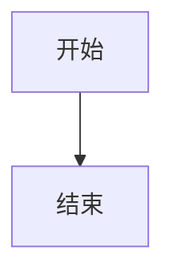

# md2word — Markdown 转 Word 文档工具

> English version: [README-en.md](README-en.md)

将 Markdown 文档转换为格式精美的 Word (.docx) 文件，支持自定义样式模板。支持图片（本地/URL）、表格、代码高亮、数学公式、Mermaid 图表、任务列表、目录、标题编号等。

## 安装

```bash
pip install -e .
# 可选增强功能：
pip install -e ".[highlight]"   # 代码语法高亮（Pygments）
pip install -e ".[math]"        # 数学公式渲染（matplotlib）
pip install -e ".[svg]"         # SVG 支持（resvg）
pip install -e ".[all]"         # 全部功能
```

需要 Python 3.10+。

## 用法

```bash
# 基本转换
md2word input.md -o output.docx

# 使用自定义模板
md2word input.md -t 模板文件.docx -o output.docx

# 批量转换（同时处理多个文件）
md2word chapter1.md chapter2.md chapter3.md

# 列出可用主题
md2word --list-themes

# 生成模板以便自定义
md2word --create-template 我的模板.docx --theme academic

# 验证模板完整性
md2word --validate-template 我的模板.docx

# 查看模板样式
md2word --list-styles -t 模板文件.docx
```

也可读取标准输入：

```bash
cat document.md | md2word -o output.docx
```

## 新功能介绍

### 目录生成
```bash
md2word input.md --toc --toc-depth 1-3
```
自动在文档开头生成 Word 目录域，在 Word 中按 Ctrl+A → F9 更新即可显示。支持通过 `--no-toc` 关闭。

### 代码语法高亮
```bash
md2word input.md  # 自动启用（需安装 Pygments）
md2word input.md --no-highlight  # 禁用
```
代码块自动检测语言并应用彩色高亮，支持 200+ 编程语言。关键词语句粗体、注释斜体、字符串/数字/关键字分别着色。

### 数学公式
```bash
md2word input.md  # 自动启用（需安装 matplotlib）
md2word input.md --no-math  # 禁用
```
支持 `$...$` 内联公式和 `$$...$$` 块级公式：
- `$E = mc^2$` → 内联渲染
- `$$\sum_{i=1}^{n} i = \frac{n(n+1)}{2}$$` → 块级渲染

LaTeX 公式渲染为 SVG 嵌入文档，清晰无限缩放。

### Mermaid 图表
````markdown

````
```bash
md2word input.md  # 自动启用
md2word input.md --no-mermaid  # 禁用
```
Mermaid 图表通过 mermaid.ink API 渲染为 SVG，无需本地安装。也支持通过 `mmdc` CLI 本地渲染（需安装 `@mermaid-js/mermaid-cli`）。

### 标题编号
```bash
md2word input.md --number-headings
```
自动为标题添加层级编号（1, 1.1, 1.1.1, ...），适用于学术论文和技术文档。

### 页面分隔
```bash
md2word input.md --page-break
```
每级 H1 标题前自动插入分页符，适合长文档按章节分页。

### 批量转换
```bash
md2word doc1.md doc2.md doc3.md
```
同时转换多个 Markdown 文件，每个生成同名的 `.docx` 文件，并显示转换进度。

### 模板验证
```bash
md2word --validate-template 我的模板.docx
```
检查模板中是否包含所有必需的引导段落（一级标题、二级标题、三级标题、正文、代码），并提示推荐添加的段落。

## 工作原理

工具通过模板 docx 中的**引导段落**来识别样式。每个引导段落包含一个关键词，告诉工具它代表什么样式元素。工具读取该段落的**格式**（字体、字号、颜色、对齐、缩进等），并应用到对应的 Markdown 内容上。

| 关键词 | 样式槽 | Markdown 元素 |
|--------|--------|---------------|
| 一级标题 | h1 | `# 标题` |
| 二级标题 | h2 | `## 标题` |
| 三级标题 | h3 | `### 标题` |
| 正文 | body | 普通段落 |
| 首行缩进 | body_indent | 首行缩进的正文 |
| 图片 | image | 图片容器 |
| 图注 | figcaption | 图片说明（alt 文本） |
| 引用 | quote | `> 引用块` |
| 代码 | code | 代码块 |
| 无序列表 | bullet_list | `- 项目` |
| 有序列表 | number_list | `1. 项目` |
| 目录标题 | toc_title | 目录标题 |

**自定义方法**：在 Word 中打开生成的模板，修改引导段落的格式，保存即可。工具会自动检测您的更改。

## 内置主题

### 官方公文
仿照《党政机关公文格式》标准：
- 仿宋三号正文，黑体标题
- 大字号（三号=16pt），1.5 倍行距
- 页边距上 3.7cm/下 3.5cm/左 2.8cm/右 2.6cm

### 学术论文
严谨学术排版风格：
- 全宋体系列，黑体标题居中
- 首行缩进 2 字符，1.5 倍行距
- 标准页边距（上下 2.54cm、左右 3.17cm）

### 技术文档
现代清晰技术文档风格：
- 微软雅黑字体，深蓝色层级标题
- 代码等宽字体（Consolas + 等线）
- 紧凑排版，信息密度高

### 自媒体排版
视觉系自媒体排版风格：
- 大号标题（32pt），品牌橙色点缀
- 1.8 倍超高行距，宽松版心
- 楷体大字号引用，舒适阅读体验

## 完整 CLI 参数

| 参数 | 说明 |
|------|------|
| `inputs` | 输入 Markdown 文件（支持多个） |
| `-o, --output` | 输出 .docx 路径 |
| `-t, --template` | 模板 .docx 文件 |
| `--image-width` | 图片最大宽度（英寸，默认 5.5） |
| `--toc / --no-toc` | 启用/禁用目录 |
| `--toc-depth` | 目录标题深度（如 `1-3`） |
| `--number-headings` | 标题自动编号 |
| `--page-break` | H1 前插入分页符 |
| `--no-highlight` | 禁用代码高亮 |
| `--no-math` | 禁用数学公式 |
| `--no-mermaid` | 禁用 Mermaid 图表 |
| `--create-template` | 生成模板文件 |
| `--theme` | 模板主题 |
| `--list-themes` | 列出可用主题 |
| `--list-styles` | 查看模板样式 |
| `--validate-template` | 验证模板完整性 |
| `--version` | 显示版本号 |

## 功能特性

- **图片**：自动下载本地和 URL 图片，缩放至页面合适宽度
- **图注**：图片 alt 文本自动置于图片下方居中显示
- **任务列表**：`[x]` 和 `[ ]` 渲染为 ☑/☐ 复选框
- **表格**：Markdown 表格渲染为浅色边框的干净表格
- **嵌套列表**：支持无序/有序列表的无限层级嵌套
- **代码块**：等宽字体，可选语法高亮（需 Pygments）
- **引用块**：完整保留，支持行内格式
- **列表**：无序和有序列表，正确缩进
- **行内格式**：**粗体**、*斜体*、`代码`、[链接](/) 完整保留
- **数学公式**：LaTeX 公式渲染为 SVG（需 matplotlib）
- **Mermaid 图表**：流程图/序列图等渲染为 SVG
- **目录**：自动生成 Word 目录域
- **标题编号**：多级标题自动编号
- **中文适配**：全部显式设置东亚字体，杜绝日文字体回退（MS Mincho 等）
- **段落换行**：Markdown 中的换行自动转为段落标记（^p），而非手动换行符
- **错误报告**：转换完成后汇总警告和错误信息

## 项目结构

```
src/md2word/
├── cli.py              — CLI 入口：参数解析、4 套主题模板
├── converter.py        — 核心转换：MD → HTML → docx，含样式提取
├── template.py         — 从引导段落提取样式格式 + 模板验证
├── image_utils.py      — 图片下载、缩放、嵌入
├── syntax.py           — 代码语法高亮（Pygments）
├── math_renderer.py    — 数学公式渲染（matplotlib → SVG）
├── mermaid_renderer.py — Mermaid 图表渲染（API / mmdc）
template/
├── 官方公文.docx
├── 学术论文.docx
├── 技术文档.docx
└── 自媒体排版.docx
```
