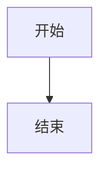

# md2word — Markdown 语法支持

> Agent 技能文件。

## 基础元素

```markdown
# 一级标题
## 二级标题
### 三级标题
#### 四级标题
##### 五级标题

普通正文段落。

> 引用块

- 无序列表项
- 另一项

1. 有序列表项
2. 另一项

`行内代码`
```

## 扩展语法

```markdown
~~删除线~~             →  Word 删除线格式
==高亮==               →  Word 黄色高亮标记
X^2^                   →  上标
H~2~O                  →  下标
- [x] 已完成任务       →  ☑ 复选框
- [ ] 待办任务         →  ☐ 复选框
```

## 脚注

```markdown
这是带脚注的文字[^1]。

[^1]: 脚注内容，支持多行。
      续行缩进 2 个空格。
```

规则：
- `[^id]` 格式，id 为数字或字母
- 定义必须放在正文之后，用空行分隔
- 定义段落以 `[^id]: ` 起始
- 无对应定义的引用会在输出中保留原文

## 交叉引用

```markdown
参考[数据说明](#数据说明)。    → Word REF 域，引用标题"数据说明"
详细设置见[表1](#表1)。        → 引用表格
请参见[图1](#图1)。            → 引用图片
```

- 方括号内 `[文字](#锚点名)` 格式
- 锚点名为目标标题或编号
- 在 Word 中 Ctrl+A → F9 更新域后生效

## 数学公式

```markdown
内联公式：$E = mc^2$
块级公式：$$\sum_{i=1}^{n} i = \frac{n(n+1)}{2}$$
```

- 依赖：matplotlib + latex2mathml（`pip install -e ".[math]"`）
- 转换为 Word OMML（原生可编辑公式）
- 块级公式自动添加 SEQ 编号
- latex2mathml 解析失败时回退为 matplotlib 渲染的 SVG

## Mermaid 图表

````markdown

````

- 方案 1：通过 http://mermaid.ink/ API 渲染（默认，无需本地安装）
- 方案 2：使用本地 mermaid-cli（需安装 `mmdc`）
- 输出为 SVG 嵌入 docx

## 表格

```markdown
| 列1 | 列2 | 列3 |
|-----|-----|-----|
| A   | B   | C   |
```

- `--three-line-table`：仅保留顶线、表头下线、底线（三线表风格）
- 默认：使用 python-markdown 的标准表格样式

## 图片

```markdown

```

- 支持本地路径和 HTTP/HTTPS URL
- 自动下载远程图片
- 自动缩放至 `--image-width`（默认 5.5 英寸）
- 支持 SVG 格式（原生嵌入或回退为 PNG）

## YAML 前置元数据

```yaml
---
title: 论文标题
author: 作者名
date: 2026-05-27
abstract: 这是摘要内容。
keywords: 关键词1, 关键词2
---
```

- `title` / `author` / `date` → 写入 docx 内置属性
- `abstract` / `keywords` → 使用对应主题模板的样式渲染为段落
